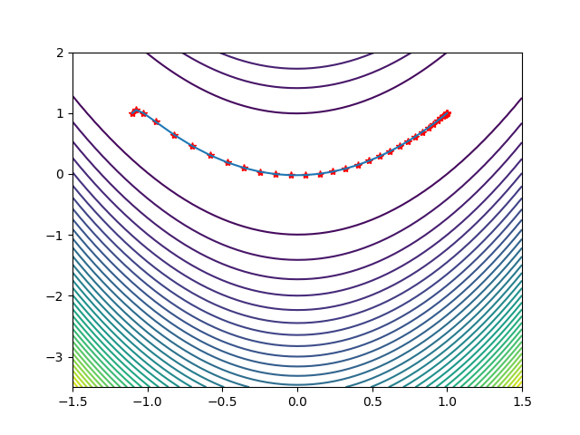

<center>
     <h1>牛顿法求极值</h1>
 </center>


## 一元函数的情况

为了能让大家更好的理解推导过程的原理，首先考虑一元函数的情况。根据一元函数的泰勒展开公式，我们对目标函数在x0点处做泰勒展开，有：
$$
f(x) = f(x_{0}) + {f}'(x_{0})(x-x_{0})+\frac{1}{2}{f}''(x_{0})(x-x_{0})^2+...+\frac{1}{n!} {f}^{(n)} (x_{0})(x-x_{0})^{n} 
$$
在求解的过程中，一般忽略2次以上的项，则有：
$$
f(x) = f(x_{0}) + {f}'(x_{0})(x-x_{0})+\frac{1}{2}{f}''(x_{0})(x-x_{0})^2
$$
可以解得：
$$
x = x_{0}-\frac{{f}'(x_{0}) }{{f}''(x_{0}) } 
$$
这样我们就得到了下一点的位置，从而走到x1。接下来重复这个过程，直到到达导数为0的点，由此得到牛顿法的迭代公式：
$$
x_{t+1} = x_{t}-\frac{{f}'(x_{t}) }{{f}''(x_{t}) } 
$$
给定初始迭代点x0，反复用上面的公式进行迭代，直到达到导数为0的点或者达到最大迭代次数。


## 多元函数的情况

根据多元函数的泰勒展开公式，我们对目标函数在x0点处做泰勒展开，有：
$$
f(\mathrm{x})=f\left(\mathrm{x}_{0}\right)+\nabla f\left(\mathrm{x}_{0}\right)^{\mathrm{T}}\left(\mathrm{x}-\mathrm{x}_{0}\right)+\frac{1}{2}\left(\mathrm{x}-\mathrm{x}_{0}\right)^{\mathrm{T}} \nabla^{2} f\left(\mathrm{x}_{0}\right)\left(\mathrm{x}-\mathrm{x}_{0}\right)+o\left(\left(\mathrm{x}-\mathrm{x}_{0}\right)^{2}\right)
$$
忽略二次及以上的项，并对上式两边同时求梯度，得到函数的导数（梯度向量）为：
$$
\bigtriangledown (x)=\bigtriangledown f(x_{0})+\bigtriangledown ^{2} f(x_{0})(x-x_{0})
$$
其中即为Hessian矩阵，在后面我们写成H。令函数的梯度为0，则有：
$$
\bigtriangledown f(x_{0})+\bigtriangledown ^{2} f(x_{0})(x-x_{0})=0\Longrightarrow x=x_{0}-(\bigtriangledown^{2}f(x_{0}))^{-1}\bigtriangledown f(x_{0}) 
$$
这是一个线性方程组的解。如果将梯度向量简写为g，上面的公式可以简写为：
$$
x = x_{0}-H^{-1}g
$$
从初始点x0处开始，反复计算函数在处的Hessian矩阵和梯度向量，然后用下述公式进行迭代：
$$
x_{k+1} = x_{k}-H_{k}^{-1}g_{k} 
$$
最终会到达函数的驻点处。其中$-H^{-1}g$称为牛顿方向。迭代终止的条件是梯度的模接近于0，或者函数值下降小于指定阈值。


## python实现牛顿法求极值

```python
import numpy as np
    import matplotlib.pyplot as plt

    def jacobian(x):
        """
        calculate gradient
        """
        return np.array([-400 * x[0] * (x[1] - x[0] ** 2) - 2 * (1 - x[0]), 200 * (x[1] - x[0] ** 2)])

    def hessian(x):
        """
        calculate Hessian Matrix
        """
        return np.array([[-400 * (x[1] - 3 * x[0] ** 2) + 2, -400 * x[0]], [-400 * x[0], 200]])


    X1 = np.arange(-1.5, 1.5 + 0.05, 0.05)
    X2 = np.arange(-3.5, 2 + 0.05, 0.05)
    [x1, x2] = np.meshgrid(X1, X2)
    f = 100 * (x2 - x1 ** 2) ** 2 + (1 - x1) ** 2  # 给定的函数
    plt.contour(x1, x2, f, 40)  # 画出函数的20条轮廓线


    def newton(x0):
        print('origin points:')
        print(x0, '\n')
        W = np.zeros((2, 10 ** 3))
        i = 1
        imax = 1000
        W[:, 0] = x0
        x = x0
        delta = 1
        alpha = 0.5

        while i < imax and delta > 10 ** (-9):
            p = -np.dot(np.linalg.inv(hessian(x)), jacobian(x))
            x0 = x
            x = x + alpha * p
            W[:, i] = x
            delta = sum((x - x0) ** 2)
            print('step', i, 'result:')
            print(x, '\n')
            i = i + 1
        W = W[:, 0:i]  # 记录迭代点
        return W


    x0 = np.array([-1.1, 1])
    W = newton(x0)

    plt.plot(W[0, :], W[1, :], 'r*', W[0, :], W[1, :])  # 画出迭代点收敛的轨迹
    plt.show()
```



## Hessian matrix

正定矩阵：给定一个大小为$n\times n$的矩阵$A$，如果对于任意长度为$n$的非零向量，都有$x^{T}Ax>0 $成立，则$A$是正定矩阵。等价于$A$的所有特征值都是正的。等价于$A$的顺序主子式都是正的。

半正定矩阵：给定一个大小为$n\times n$的矩阵$A$，如果对于任意长度为$n$的非零向量，都有$x^{T}Ax\ge 0$，则$A$是半正定矩阵。

负定矩阵：给定一个大小为$n\times n$的矩阵$A$，如果对于任意长度为$n$的非零向量，都有$x^{T}Ax<0 $成立，则$A$是负定矩阵。


基于Hessian矩阵，就可以判断多元函数的极值情况，结论如下：

- 如果是正定矩阵，则临界点处是一个局部极小值
- 如果是负定矩阵，则临界点处是一个局部极大值
- 如果是不定矩阵，则临界点处不是极值

