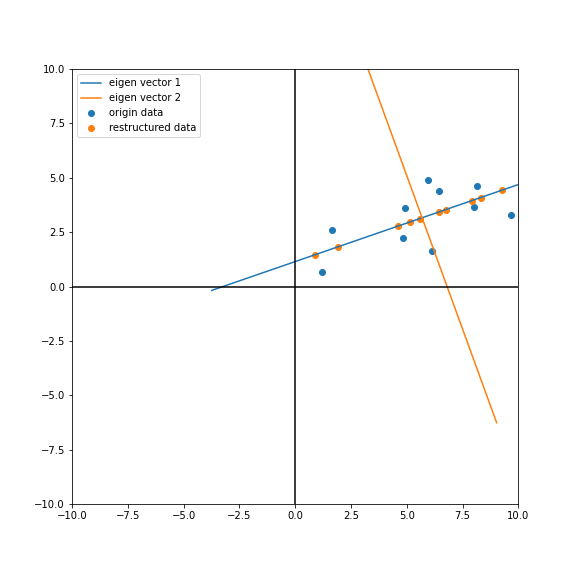
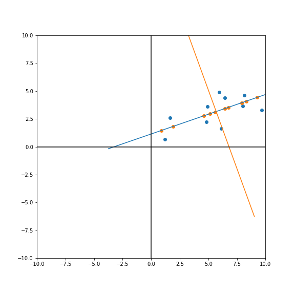
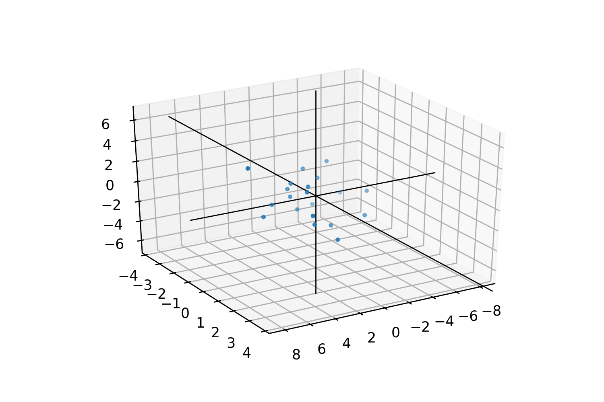

<center>
     <h1>Principal Component Analysis</h1>
 </center>

主成分分析（Principal Component Analysis，PCA）是一种多变量统计方法，它是最常用的降维方法之一，通过正交变换将一组可能存在相关性的变量数据转换为一组线性不相关的变量，转换后的变量被称为主成分。可以使用两种方法进行 PCA，分别是特征分解或奇异值分解（SVD）。

## 1、协方差

$$
cov(X,Y)=\frac{ {\textstyle \sum_{i=1}^{n}}(X_{i}-\bar{X} ) }{n-1} 
$$


协方差其意义： 度量各个维度偏离其均值的程度。协方差的值如果为正值，则说明两者是正相关的(从协方差可以引出“相关系数”的定义)，结果为负值就说明负相关的，如果为0，也是就是统计上说的“相互独立”。

协方差矩阵：
$$
C=\begin{pmatrix}
 cov(x,x) & cov(x,y) & cov(x,z)\\
  cov(y,x) & cov(y,y) & cov(y,z) \\
  cov(z,x) & cov(z,y) & cov(z,z)
\end{pmatrix}
$$
从协方差矩阵上，可以得到变量之间两两的相关性：

```python
import numpy as np
#设置一下np的输出格式
np.set_printoptions(threshold=100,precision= 4,suppress=True)
```

```python
# 计算以下数据的协方差矩阵
import numpy as np
np.random.seed(0)
data = np.random.uniform(1,10,(10,2))
data[:,1:] = 0.5*data[:,0:1]+np.random.uniform(-2,2,(10,1))
data

>>>array([[5.9393, 4.8841],
                   [6.4249, 4.4091],
                   [4.8129, 2.2524],
                   [4.9383, 3.5913],
                   [9.673 , 3.3096],
                   [8.1255, 4.6224],
                   [6.1124, 1.6296],
                   [1.6393, 2.5983],
                   [1.182 , 0.6784],
                   [8.0034, 3.6604]])
```

必须去中心化

```python
data_norm = data-data.mean(axis = 0)
data_norm

>>>array([[ 0.2542,  1.7206],
                   [ 0.7398,  1.2455],
                   [-0.8722, -0.9112],
                   [-0.7468,  0.4277],
                   [ 3.9879,  0.146 ],
                   [ 2.4404,  1.4589],
                   [ 0.4273, -1.5339],
                   [-4.0458, -0.5652],
                   [-4.5031, -2.4852],
                   [ 2.3183,  0.4968]])
```

```python
X = data_norm[:,0]
Y = data_norm[:,1]
X,Y

>>>(array([ 0.2542,  0.7398, -0.8722, -0.7468,  3.9879,  2.4404,  0.4273,
        -4.0458, -4.5031,  2.3183]),
        
>>> array([ 1.7206,  1.2455, -0.9112,  0.4277,  0.146 ,  1.4589, -1.5339,
        -0.5652, -2.4852,  0.4968]))
```

```python
# 定义一个函数，输入X，Y能得到X，Y之间的协方差
def getcov(X,Y):

    covxy = ((X-X.mean())*(Y-Y.mean())).sum()/(len(X)-1)

    return covxy
```

```python
getcov(X,X)

>>>7.332530886964573
```


numpy自带了协方差矩阵的计算方法，验证一下：

```python
# 这里需要解释一下，为什么需要计算转置的协方差。在我们学习线性代数的过程中通常是一列向量来表示，但是在实际的运算过程中，我们通常会把每一行当成一个数据，每列当成这个数据的feature。
C = np.cov(data_norm.T)

>>>array([[7.3325, 2.2168],
                   [2.2168, 1.8633]])
```


## 2、计算协方差矩阵的特征向量和特征值

由矩阵特征值特征向量的定义：
$$
C\nu =\lambda \upsilon 
$$
其中，$\lambda $是特征向量$\upsilon $对应的特征值，一个矩阵的一组特征向量是一组正交量。

特征值分解

对于矩阵$C$，有一组特征向量$V$，将这组向量进行正交单位化，就能得到一组正交单位向量。

特征值分解：就是将矩阵$C$分解为如下式：
$$
C=Q\Sigma Q^{-1} 
$$
其中，$Q$就是矩阵$C$的特征向量组成的矩阵，$\Sigma $则是一个对角矩阵，对角线上的元素就是特征值。

```python
#计算特征值和特征向量
vals, vecs = np.linalg.eig(C)
#重新排序，从大到小（添加负号从大到小排列）
vecs = vecs[:,np.argsort(-vals)]
vals = vals[np.argsort(-vals)]
```

```python
#第一个特征值对应的特征向量
vals[0],vecs[:,0]
#第二个特征值对应的特征向量
vals[1],vecs[:,1]

>>> (8.118170385604765, array([0.9426, 0.334 ]))
>>> (1.0776889576956008, array([-0.334 ,  0.9426]))
```

**这时候，相当于已经在数据中定义了两个轴，第一个轴的方向是第一个特征向量$v_{1}$，第二个轴的方向是第二个特征向量$v_{2}$**。


```python
%matpoltlib inline
import matplotlib.pyplot as plt
#设置图大小
size = 15

plt.figure(1,(8,8))

plt.scatter(data[:,0],data[:,1],label='origin data')

i=0
ev = np.array([vecs[:,i]*-1,vecs[:,i]])*size
ev = (ev+data.mean(0))
plt.plot(ev[:,0],ev[:,1],label = 'eigen vector '+str(i+1))

i=1
ev = np.array([vecs[:,i]*-1,vecs[:,i]])*size
ev = (ev+data.mean(0))
plt.plot(ev[:,0],ev[:,1],label = 'eigen vector '+str(i+1))

#plt.plot(vecs[:,1]*-10,vecs[:,1]*10)

#画一下x轴y轴
plt.plot([-size,size],[0,0],c='black')
plt.plot([0,0],[-size,size],c='black')
plt.xlim(-size,size)
plt.ylim(-size,size)
plt.legend()
plt.show()
```


如果用PCA把$m$个维度的数据降纬成$k$个维度，即只用前$k$个主成分来表示，那么数据在主成分上的投影坐标是：
$$
Y_{n*k}=X_{n*m}Q_{m*k}
$$
***


需要解释一下：在线性代数本质中，$X$要通过变换映射成$Y$，那么不应该$Q$在$X$的左边吗？

答案：因为这里已经将$X$进行了转置。其实$X$的维度是$X_{m*n}$
$$
(Q_{k*m}X_{m*n})^{T}=(Y_{k*n})^{T}
$$

$$
(X_{m*n})^T(Q_{k*m})^T = (Y_{n*k})^T
$$

也即使：
$$
(X_{m*n})^T(Q_{k*m})^T = (Y_{k*n})^T   \Rightarrow  Y_{n*k}=X_{n*m}Q_{m*k}
$$

***

$Q$为特征向量组成的矩阵：

```python
#数据在主成分1上的投影坐标是Y
k=1
Q = vecs[:,:k]
Y = np.matmul(data_norm,Q)
Y

>>>array([[ 0.8144],
           [ 1.1133],
           [-1.1265],
           [-0.561 ],
           [ 3.8076],
           [ 2.7876],
           [-0.1097],
           [-4.0022],
           [-5.0746],
           [ 2.3511]])

```

这个时候我们相当于只需要存储**前k个主成分的特征向量$Q_{m*k}$和数据在前k个主成分上的投影坐标$Y_{n*k}$**，就可以还原数据
$$
Y_{n*k}Q_{m*k}^T = X_{n*m}
$$
其中，由于$Q$已经正交化，$Q_{m*k}^{T} Q_{m*k} = I_{k*k}$。

```python
#得到去中心化的还原数据
np.matmul(Y,Q.T)

>>>array([[ 0.7676,  0.272 ],
           [ 1.0494,  0.3719],
           [-1.0618, -0.3763],
           [-0.5288, -0.1874],
           [ 3.5888,  1.2719],
           [ 2.6275,  0.9312],
           [-0.1034, -0.0366],
           [-3.7723, -1.3369],
           [-4.7831, -1.6952],
           [ 2.216 ,  0.7854]])
```

```python
#加上均值，还原数据
data_ = np.matmul(Y,Q.T)+data.mean(0)
data_

>>>array([[6.4527, 3.4356],
           [6.7345, 3.5355],
           [4.6233, 2.7873],
           [5.1563, 2.9761],
           [9.2739, 4.4355],
           [8.3125, 4.0947],
           [5.5817, 3.1269],
           [1.9128, 1.8266],
           [0.902 , 1.4684],
           [7.9011, 3.9489]])
```


## 3、降维重构的数据与原数据对比

### 3.1 用我们的方法

```python
import matplotlib.pyplot as plt
#设置图大小
size = 10

plt.figure(1,(8,8))

plt.scatter(data[:,0],data[:,1],label='origin data')

plt.scatter(data_[:,0],data_[:,1],label='restructured data')

i=0
ev = np.array([vecs[:,i]*-1,vecs[:,i]])*size
ev = (ev+data.mean(0))
plt.plot(ev[:,0],ev[:,1],label = 'eigen vector '+str(i+1))

i=1
ev = np.array([vecs[:,i]*-1,vecs[:,i]])*size
ev = (ev+data.mean(0))
plt.plot(ev[:,0],ev[:,1],label = 'eigen vector '+str(i+1))

#plt.plot(vecs[:,1]*-10,vecs[:,1]*10)

#画一下x轴y轴
plt.plot([-size,size],[0,0],c='black')
plt.plot([0,0],[-size,size],c='black')
plt.xlim(-size,size)
plt.ylim(-size,size)
plt.legend()
plt.show()
```



### 3.2 用sklearn的PCA


```python
import matplotlib.pyplot as plt
import sklearn
#sklearn PCA
from sklearn.decomposition import PCA
pca = PCA(n_components=2) 
pca.fit(data)
Y = pca.fit_transform(data)
vecs = pca.components_.T
data_ = np.dot(Y[:,:1],vecs[:,:1].T)+data.mean(0)


#设置图大小
size = 10

plt.figure(1,(8,8))

plt.scatter(data[:,0],data[:,1],label='origin data')

plt.scatter(data_[:,0],data_[:,1],label='restructured data')

i=0
ev = np.array([vecs[:,i]*-1,vecs[:,i]])*size
ev = (ev+data.mean(0))
plt.plot(ev[:,0],ev[:,1],label = 'eigen vector '+str(i+1))

i=1
ev = np.array([vecs[:,i]*-1,vecs[:,i]])*size
ev = (ev+data.mean(0))
plt.plot(ev[:,0],ev[:,1],label = 'eigen vector '+str(i+1))

#plt.plot(vecs[:,1]*-10,vecs[:,1]*10)

#画一下x轴y轴
plt.plot([-size,size],[0,0],c='black')
plt.plot([0,0],[-size,size],c='black')
plt.xlim(-size,size)
plt.ylim(-size,size)
plt.legend()
plt.show()
```



###  3.3 用SVD


```python
#用SVD主要是想用SVD求出主成分的方向向量
U,vals,V = np.linalg.svd(data_norm)
vecs = V.T

#数据在主成分1上的投影坐标是Y
Y = np.matmul(data_norm,vecs[:,:1])
#得到去中心化的还原数据
data_ = np.matmul(Y,vecs[:,:1].T)+data.mean(0)
```

```python
#画图
import matplotlib.pyplot as plt
#设置图大小
size = 10

plt.figure(1,(8,8))

plt.scatter(data[:,0],data[:,1],label='origin data')

plt.scatter(data_[:,0],data_[:,1],label='restructured data')

#绘制主成分的向量
i=0
ev = np.array([vecs[:,i]*-1,vecs[:,i]])*size
ev = (ev+data.mean(0))
plt.plot(ev[:,0],ev[:,1],label = 'eigen vector '+str(i+1))

i=1
ev = np.array([vecs[:,i]*-1,vecs[:,i]])*size
ev = (ev+data.mean(0))
plt.plot(ev[:,0],ev[:,1],label = 'eigen vector '+str(i+1))

#plt.plot(vecs[:,1]*-10,vecs[:,1]*10)

#画一下x轴y轴
plt.plot([-size,size],[0,0],c='black')
plt.plot([0,0],[-size,size],c='black')
plt.xlim(-size,size)
plt.ylim(-size,size)
plt.legend()
plt.show()
```


## 4、三维数据的测试

```python
# 计算以下数据的协方差矩阵
import numpy as np
np.random.seed(0)
data = np.random.uniform(-10,10,(20,3))
data[:,1:] = 0.5*data[:,0:1]+np.random.uniform(-2,2,(20,1))
data[:,2:] = 0.5*data[:,0:1]+np.random.uniform(-3,3,(20,1))
data_normal = data-data.mean(0)
```

```python
C = np.cov(data_normal.T)

#计算特征值和特征向量
vals, vecs = np.linalg.eig(C)
#重新排序，从大到小
vecs = vecs[:,np.argsort(-vals)]
vals = vals[np.argsort(-vals)]

vals,vecs
```

```python
import matplotlib.pyplot as plt, mpld3
from mpl_toolkits.mplot3d import Axes3D
import matplotlib.cm as cm

X = data[:,0]
Y = data[:,1]
Z = data[:,2]

for i in range(45, 60):
    #让图转起来
    import IPython
    IPython.display.clear_output(wait=True)

    fig = plt.figure(1,(6,4),dpi = 250)
    ax = fig.gca(projection='3d')

    plt.cla()
    #绘制散点
    ax.scatter(X,Y,Z,s=5)

    #绘制xyz轴
    ax.plot([0,0],[0,0],[-10,10],c = 'black',linewidth = 0.8)
    ax.plot([0,0],[-10,10],[0,0],c = 'black',linewidth = 0.8)
    ax.plot([-10,10],[0,0],[0,0],c = 'black',linewidth = 0.8)
    
    
    ax.view_init(azim=i)
    plt.xlim(-X.max(), X.max())
    plt.ylim(-Y.max(), Y.max())
    ax.set_zlim(-Z.max(),Z.max())
    plt.title('PCA')
    plt.show()
```



```python
#数据在主成分1上的投影坐标是
zcf = np.matmul(data_normal,vecs[:,:2])
data_ = np.matmul(zcf,vecs[:,:2].T)+data.mean(0)

data_
>>>array([[ 0.466 , -0.119 , -0.3664],
           [ 0.3823, -0.3452,  0.1743],
           [-1.0858, -0.2398, -3.3149],
           [-2.5468, -2.293 ,  0.0896],
           [ 1.1163, -0.1704,  1.1939],
           [-8.3776, -4.4755, -5.4804],
           [ 6.336 ,  2.919 ,  2.5613],
           [ 5.1451,  2.6233,  0.9454],
           [-6.6908, -3.8655, -3.8009],
           [ 8.7146,  3.0963,  7.1057],
           [-3.7568, -1.861 , -3.8863],
           [ 1.6788,  0.0988,  1.5444],
           [ 2.99  ,  1.9181, -1.4365],
           [ 4.2061,  1.3924,  2.8509],
           [ 4.4044,  2.2631,  0.5024],
           [ 2.5662,  1.119 ,  0.1996],
           [-3.7324, -2.6537, -1.3076],
           [-2.0326, -0.9396, -3.1188],
           [-5.6263, -4.0178, -1.0289],
           [-5.7263, -2.817 , -5.0701]])

```

```python
import matplotlib.pyplot as plt, mpld3
from mpl_toolkits.mplot3d import Axes3D
import matplotlib.cm as cm


X = data[:,0]
Y = data[:,1]
Z = data[:,2]

X_ = data_[:,0]
Y_ = data_[:,1]
Z_ = data_[:,2]

for i in range(35,55):
    #让图转起来
    import IPython
    IPython.display.clear_output(wait=True)

    fig = plt.figure(1,(6,4),dpi = 250)
    ax = fig.gca(projection='3d')

    plt.cla()
    #绘制散点
    ax.scatter(X,Y,Z,s=5,label='origin data')
    
    ax.scatter(X_,Y_,Z_,s=5,label='restructured data')
    ax.plot_trisurf(X_, Y_, Z_)
    #绘制xyz轴
    ax.plot([0,0],[0,0],[-10,10],c = 'black',linewidth = 0.8)
    ax.plot([0,0],[-10,10],[0,0],c = 'black',linewidth = 0.8)
    ax.plot([-10,10],[0,0],[0,0],c = 'black',linewidth = 0.8)
    
    
    ax.view_init(azim=i)
    plt.xlim(-X.max(), X.max())
    plt.ylim(-Y.max(), Y.max())
    ax.set_zlim(-Z.max(),Z.max())
    plt.title('PCA')
    plt.show()
```


