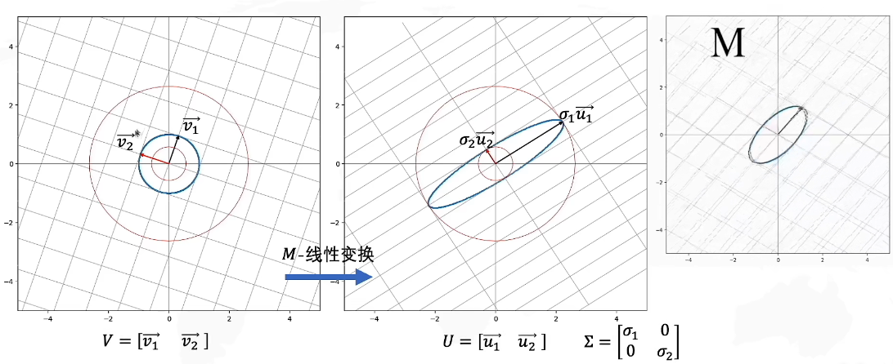
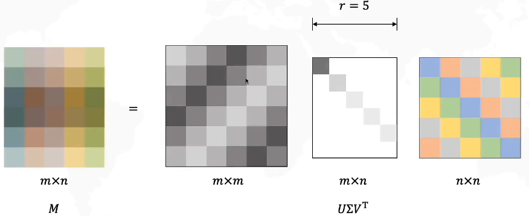
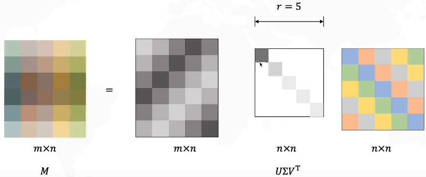
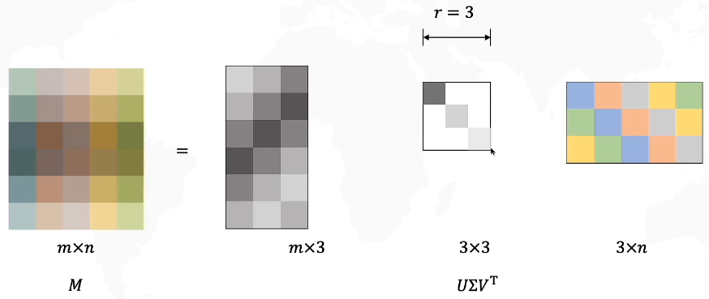
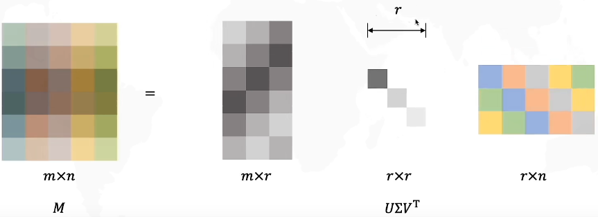
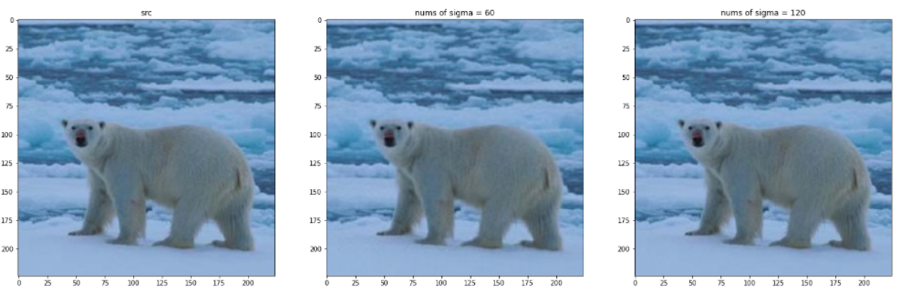

<center>
     <h1>singular value decomposition</h1>
 </center>
## 理论知识

矩阵的奇异值分解（singular value decomposition，简称SVD）是线性代数中很重要的内容，并且奇异值分解过程也是线性代数中相似对角化分解（也被称为特征值分解，eigenvalue decomposition，简称EVD）的延伸。因此，以下将从线性代数中最基础的矩阵分解开始讲起，引出奇异值分解的定义，并最终给出奇异值分解的低秩逼近问题相关的证明过程。




如上图所示，左图一组基经过线性变换M，与右图线性变化是等价的。
$$
MV=U\Sigma 
$$
也即是：
$$
M=U\Sigma V^{-1} 
$$
其中：**$V$是原始域的标准正交基，$U$是经过$M$变换后的标准正交基**


## SVD推广到任意大小矩阵



我们可以发现$\Sigma $矩阵的最后一行（第6行）全是0，对于$U$最后一列是乘以$\Sigma $的最后一行，所以完全可以省略$U$最后一列。




**还可以发现$\Sigma $矩阵的奇异值大小是从上到下依次排列的。**

我们就可以只取前几个奇异值。







## 奇异值分解应用

假设我们现在有矩阵$M$,需要对其做奇异值分解，已知:
$$
M=\begin{bmatrix}
  1&  5&  7& 6 &1\\
  2&  1&  10& 4 &4\\
  3&  6&  7& 5 &2
\end{bmatrix}
$$


那么可以求出$MM ^{T}$和$M ^{T}M$：
$$
MM ^{T} = \begin{bmatrix}
  112& 105 & 114\\
  105&  137& 110 \\
  114&  110&123
\end{bmatrix}

&&&
M^{T}M  = \begin{bmatrix}
  14&25 & 48 &29  &15 \\
  25& 62 &87  & 64 &21 \\
  48& 87 & 198 & 117 &61 \\
  29& 64 &117  &77  &32 \\
  15& 21 & 61 & 32 &21
\end{bmatrix}
$$


```python
U = 
[[-0.55572489, -0.72577856,  0.40548161],
 [-0.59283199,  0.00401031, -0.80531618],
 [-0.58285511,  0.68791671,  0.43249337]]
 
V = 
[[-0.18828164, -0.01844501,  0.73354812,  0.65257661,  0.06782815],
 [-0.37055755, -0.76254787,  0.27392013, -0.43299171, -0.17061957],
 [-0.74981208,  0.4369731 , -0.12258381, -0.05435401, -0.48119142],
 [-0.46504304, -0.27450785, -0.48996859,  0.39500307,  0.58837805],
 [-0.22080294,  0.38971845,  0.36301365, -0.47715843,  0.62334131]]
```

奇异值$\Sigma =Diag(18.54,1.83,5.01)$

计算$MM^{T}$: **numpy.dot(M, numpy.transpose(M))**


### 在图像压缩中的应用

下面的代码运行环境为`python3.6`+`jupyter`

```python
%matplotlib inline
import matplotlib.pyplot as plt
from PIL import Image
import numpy as np

img_eg = Image.open('./ILSVRC2012_test_00000439_ground.jpg')
image_numpy_form_Image = np.array(img_eg)
h,w,c = image_numpy_form_Image.shape

img_temp = image_numpy_form_Image.reshape(h, w * 3)
U,Sigma,VT = np.linalg.svd(img_temp)

# 取前60个奇异值
sval_nums = 60
img_restruct1 = (U[:,0:sval_nums]).dot(np.diag(Sigma[0:sval_nums])).dot(VT[0:sval_nums,:])
img_restruct1 = img_restruct1.reshape(h,w,c)
 
# 取前120个奇异值
sval_nums = 120
img_restruct2 = (U[:,0:sval_nums]).dot(np.diag(Sigma[0:sval_nums])).dot(VT[0:sval_nums,:])
img_restruct2 = img_restruct2.reshape(h,w,c)

# plot figure
fig, ax = plt.subplots(1,3,figsize = (24,32))
ax[0].imshow(img_eg)
ax[0].set(title = "src")
ax[1].imshow(img_restruct1.astype(np.uint8))
ax[1].set(title = "nums of sigma = 60")
ax[2].imshow(img_restruct2.astype(np.uint8))
ax[2].set(title = "nums of sigma = 120")
```


