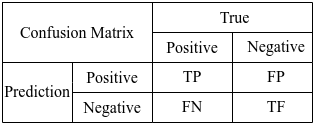
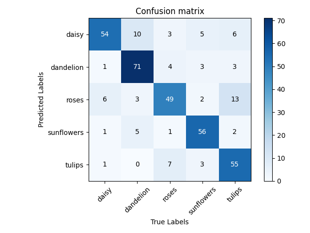

## Confusion Matrix

***

 $Precision=\frac{TP}{TP + FP} $

$Recall=\frac{TP}{TP + FN} $

$Specificity=\frac{TF}{FP + TF} $

***

***

> File structure:
>>confusionMatrix.py : including the class of Confusion Matrix

