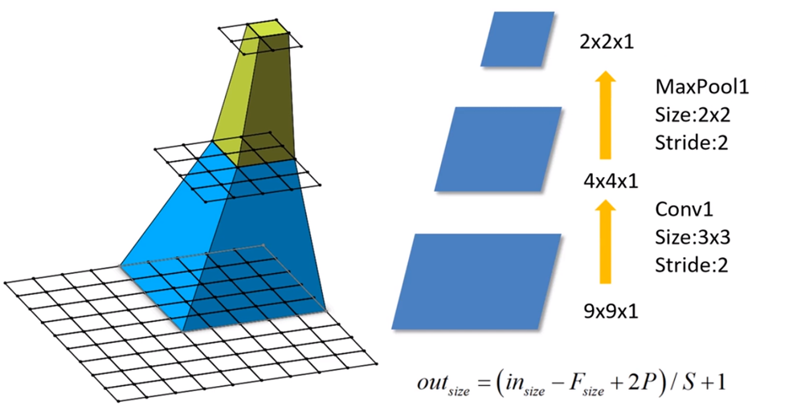

## Receptive field

**在卷积神经网络中，决定某一层输出结果所对应的输入层的区域大小，被称作为感受野（receptive field）。通俗的解释是，输出feature map上的一个单元对应输入层的区域大小。**

### Receptive field  formula

$ F(i)=(F(i+1) -1 )*stride + Ksize $

- $F(i)$为第$i$层的感受野
- $stride$为第$i$层的步距
- $Ksize$为卷积核的尺寸

***

**可以通过堆叠两个$3\times 3$的卷积核替代的卷积核，堆叠三个$3\times 3$的卷积核替代的$7\times 7$卷积核。(why?)**

1. **减少模型的参数**
2. **增加模型的非线性能力**

***

- **Feature map :  $F=1$**
- **Conv3x3(3)** : $F = (1-1) * 1+ 3=3$
- **Conv3x3(2)** : $F=(3-1) * 1+ 3=5$（$5\times 5$卷积核感受野，所以只需要两个的$3\times 3$卷积核就能替代一个$5\times 5$卷积核）
- **Conv3x3(1)** : $F=(5-1) * 1+ 3=7$（$7\times 7$卷积核感受野，所以只需要三个$3\times 3$的卷积核就能替代一个$7\times 7$卷积核）

***

**使用7x7的卷积核所需参数，与堆叠三个3x3卷积核所需参数（假设输入输出的channel都是C，并且忽略bias）**

$7\times 7\times C\times C=49C$

$3\times 3\times C\times C + 3\times 3\times C\times C +3\times 3\times C\times C=27C$

**可以明显的发现参数量减少**

