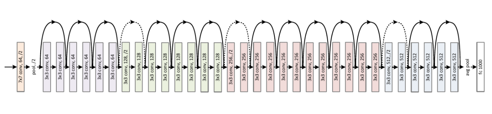
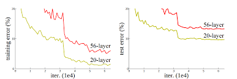
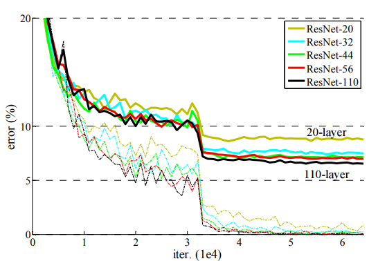
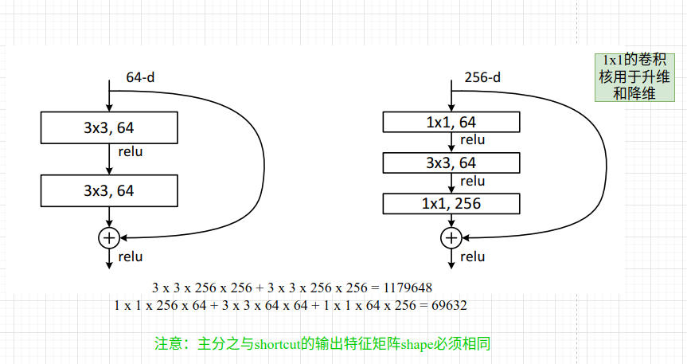
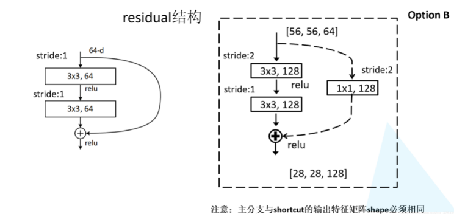
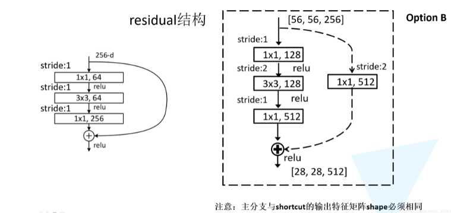
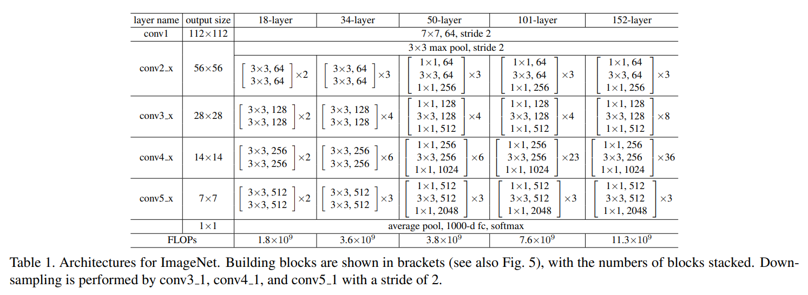
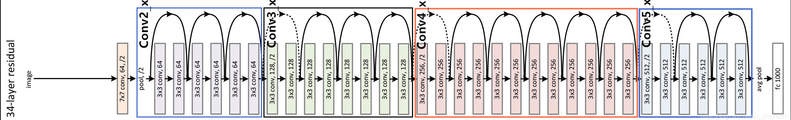

## ResNet网络结构详解与模型的搭建结构：
ResNet网络是在2015年由微软实验室提出，斩获当年ImageNet竞赛中分类任务第一名，目标检测第一名。获得COCO数据集中目标检测第一名，图像分割第一名。下图是ResNet34层模型的结构简图。

在ResNet网络中有如下几个亮点：

（1）提出residual结构（残差结构），并搭建超深的网络结构(突破1000层)

（2）使用Batch Normalization加速训练(丢弃dropout)

在ResNet网络提出之前，传统的卷积神经网络都是通过将一系列卷积层与下采样层进行堆叠得到的。但是当堆叠到一定网络深度时，就会出现两个问题。1）梯度消失或梯度爆炸。 2）退化问题(degradation problem)。在ResNet论文中说通过数据的预处理以及在网络中使用BN（Batch Normalization）层能够解决梯度消失或者梯度爆炸问题。如果不了解BN层可参考这个[链接](https://github.com/MorvanLi/Python/tree/main/pytorch_classification/normalization/batch%20normalization)。**但是对于退化问题**（随着网络层数的加深，效果还会变差，如下图所示）并没有很好的解决办法。

所以ResNet论文提出了residual结构（残差结构）来减轻退化问题。下图是使用residual结构的卷积网络，可以看到随着网络的不断加深，效果并没有变差，反而变的更好了。

***

接着，我们就来分析下论文中的残差结构（residual），下图是论文中给出的两种残差结构。左边的残差结构是针对层数较少网络，例如ResNet18层和ResNet34层网络。右边是针对网络层数较多的网络，例如ResNet101，ResNet152等。为什么深层网络要使用右侧的残差结构呢。因为，右侧的残差结构能够减少网络参数与运算量。同样输入、输出一个channel为256的特征矩阵，如果使用左侧的残差结构需要大约1170648个参数，但如果使用右侧的残差结构只需要69632个参数。明显搭建深层网络时，使用右侧的残差结构更合适。

我们先对左侧的残差结构（针对ResNet18/34）进行一个分析。如下图所示，该残差结构的主分支是由两层3x3的卷积层组成，而残差结构右侧的连接线是shortcut分支也称捷径分支（注意为了让主分支上的输出矩阵能够与我们捷径分支上的输出矩阵进行相加，必须保证这两个输出特征矩阵有相同的shape）。如果刚刚仔细观察了ResNet34网络结构图的同学，应该能够发现图中会有一些虚线的残差结构。在原论文中作者只是简单说了这些虚线残差结构有降维的作用，并在捷径分支上通过1x1的卷积核进行降维处理。而下图右侧给出了详细的虚线残差结构，注意下每个卷积层的步距stride，以及捷径分支上的卷积核的个数（与主分支上的卷积核个数相同）。

接着我们再来分析下针对ResNet50/101/152的残差结构，如下图所示。在该残差结构当中，主分支使用了三个卷积层，第一个是1x1的卷积层用来压缩channel维度，第二个是3x3的卷积层，第三个是1x1的卷积层用来还原channel维度（注意主分支上第一层卷积层和第二层卷积层所使用的卷积核个数是相同的，第三层是第一层的4倍）。该残差结构所对应的虚线残差结构如下图右侧所示，同样在捷径分支上有一层1x1的卷积层，它的卷积核个数与主分支上的第三层卷积层卷积核个数相同，注意每个卷积层的步距。（注意：原论文中，在下图右侧虚线残差结构的主分支中，第一个1x1卷积层的步距是2，第二个3x3卷积层步距是1。但在pytorch官方实现过程中是第一个1x1卷积层的步距是1，第二个3x3卷积层步距是2，这么做的好处是能够在top1上提升大概0.5%的准确率。可参考Resnet v1.5 https://ngc.nvidia.com/catalog/model-scripts/nvidia:resnet_50_v1_5_for_pytorch）

下面这幅图是原论文给出的不同深度的ResNet网络结构配置，注意表中的残差结构给出了主分支上卷积核的大小与卷积核个数，表中的xN表示将该残差结构重复N次。那到底哪些残差结构是虚线残差结构呢。

对于我们ResNet18/34/50/101/152，表中conv3_x, conv4_x, conv5_x所对应的一系列残差结构的第一层残差结构都是虚线残差结构。因为这一系列残差结构的第一层都有调整输入特征矩阵shape的使命（将特征矩阵的高和宽缩减为原来的一半，将深度channel调整成下一层残差结构所需要的channel）。为了方便理解，下面给出了ResNet34的网络结构图，图中简单标注了一些信息。

对于我们ResNet50/101/152，其实在conv2_x所对应的一系列残差结构的第一层也是虚线残差结构。因为它需要调整输入特征矩阵的channel，根据表格可知通过3x3的max pool之后输出的特征矩阵shape应该是[56, 56, 64]，但我们conv2_x所对应的一系列残差结构中的实线残差结构它们期望的输入特征矩阵shape是[56, 56, 256]（因为这样才能保证输入输出特征矩阵shape相同，才能将捷径分支的输出与主分支的输出进行相加）。所以第一层残差结构需要将shape从[56, 56, 64] --> [56, 56, 256]。注意，这里只调整channel维度，高和宽不变（而conv3_x, conv4_x, conv5_x所对应的一系列残差结构的第一层虚线残差结构不仅要调整channel还要将高和宽缩减为原来的一半）。

