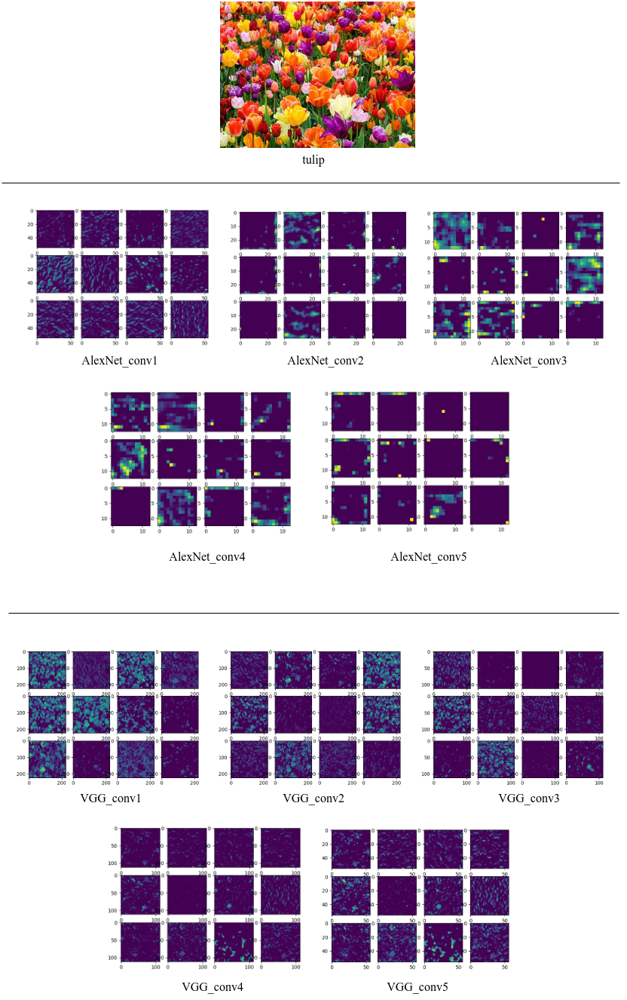
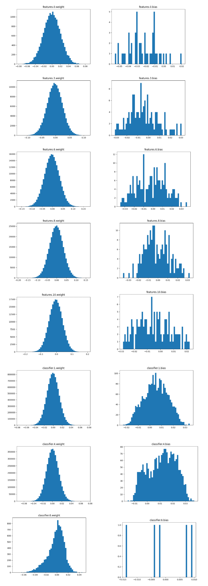

## analyze_weights_featuremap：

**By observing the feature maps of the first five convolutions of the AlexNet and VGG networks, it is obvious that the VGG network performs better.**

***

**analyze_kerner_weight**

***

