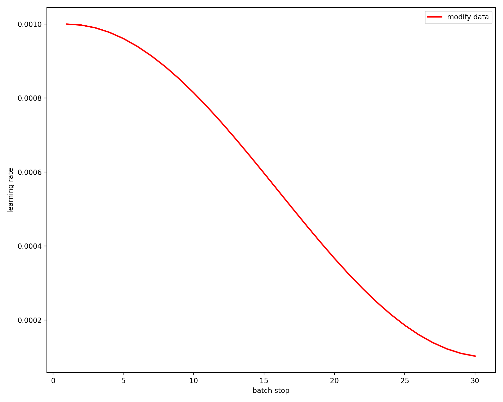

# 【学习率调整】学习率衰减之周期余弦退火 （cyclic cosine annealing learning rate schedule）

## 概述
在论文《SGDR: Stochastic Gradient Descent with Warm Restarts》中主要介绍了带重启的随机梯度下降算法（SGDR），其中就引入了余弦退火的学习率下降方式。

当我们使用梯度下降算法来优化目标函数的时候，当越来越接近Loss值的全局最小值时，学习率应该变得更小来使得模型尽可能接近这一点，而余弦退火（cosine annealing）可以通过余弦函数来降低学习率。余弦函数中随着x的增加余弦值首先缓慢下降，然后加速下降，再次缓慢下降。这种下降模式能和学习率配合，以一种十分有效的计算方式来产生很好的效果。



### 1.需要用到的库

```python
import math
import matplotlib.pyplot as plt
import torch.optim as optim
```

### 2.LambdaLR实现cosine learning rate

```python
lrf = 0.1
optimizer = optim.Adam(net.parameters(), lr=0.001)
lf = lambda x: ((1 + math.cos(x * math.pi / epochs)) / 2) * (1 - lrf) + lrf  # cosine
scheduler = optim.lr_scheduler.LambdaLR(optimizer, lr_lambda=lf)
```

### 3.learning rate记录

```python
lr_list.append(optimizer.param_groups[0]['lr'])
lr_epoch.append(epoch)
scheduler.step()  # update the lr
```


### 4.可视化learning rate

```python
plt.figure(figsize=(10, 8), dpi=200)
plt.xlabel('batch stop')
plt.ylabel('learning rate')
plt.plot(x, y, color='r', linewidth=2.0, label='modify data')
plt.legend(loc='upper right')
plt.savefig('result.png')
plt.show()
```

