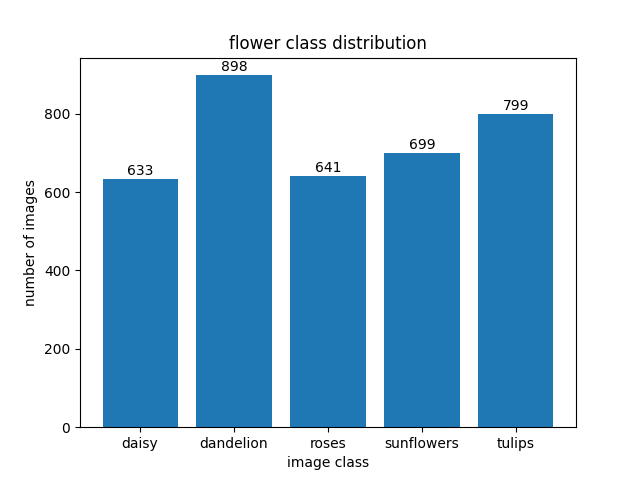
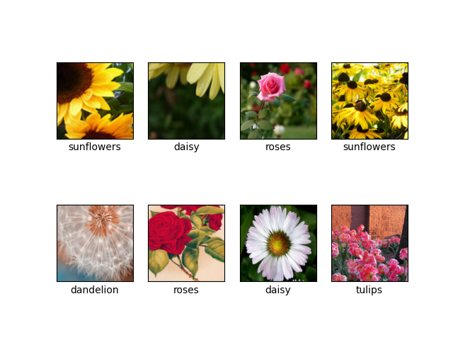

## File Structure：

> my_dataset.py :  customized dataset
> > >**collate_fn** : Rewrited how dataloader enters data. First parse the batch data,  secondly, the parsed data is extracted separately by zip. Finally, the data is packed by tuple.

 

***

