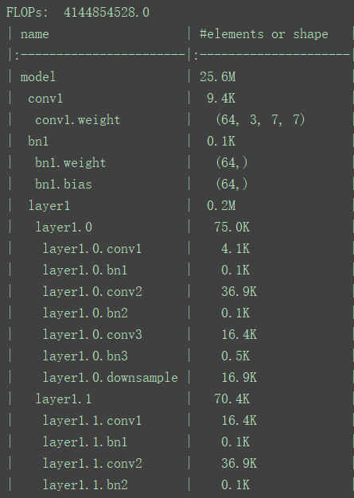
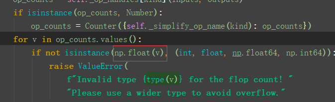

## 使用fvcore计算Pytorch中模型的参数数量以及FLOPs


`fvcore`是Facebook开源的一个轻量级的核心库，它提供了各种计算机视觉框架中常见且基本的功能。其中就包括了统计模型的参数以及FLOPs等。

在python环境中安装fvcore：

```python
pip install fvcore
```


假设计算以下resnet50的参数数量以及FLOPs参数。

```python
import torch
from torchvision.models import resnet50
from fvcore.nn import FlopCountAnalysis, parameter_count_table

# 创建resnet50网络
model = resnet50(num_classes=1000)

# 创建输入网络的tensor
tensor = (torch.rand(1, 3, 224, 224),)

# 分析FLOPs
flops = FlopCountAnalysis(model, tensor)
print("FLOPs: ", flops.total())

# 分析parameters
print(parameter_count_table(model))
```





:zap: **如果出现ValueError: Invalid type <class 'numpy.int32'> for the flop count! Please use a wider type to avoid overflow。**报错是意思int32溢出了，只需要将v强制转换为np.float(v)即可。


