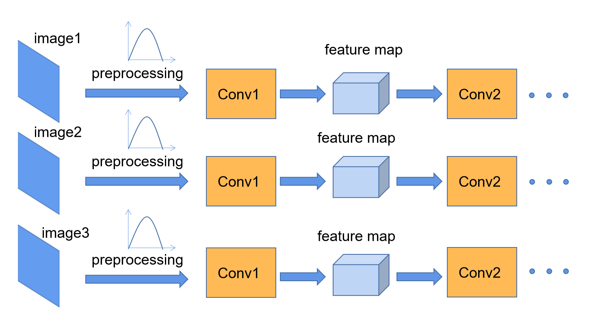
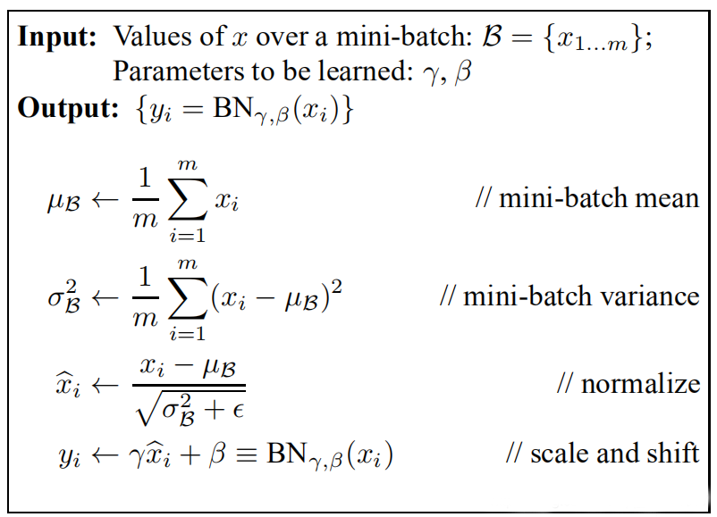
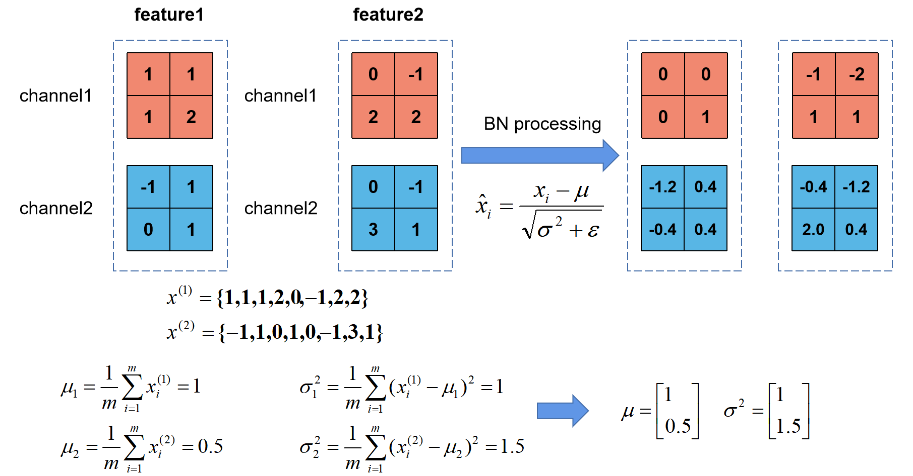
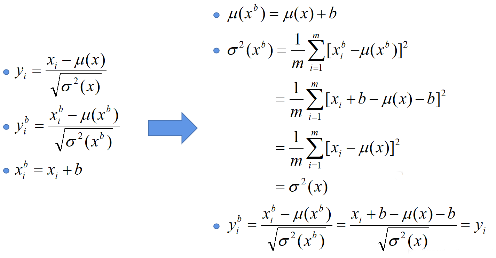

 <center>
     <h1>Batch Normalization详解</h1>
 </center>

## 1、Batch Normalization原理

​		在图像预处理过程中通常会对图像进行标准化处理，这样能够加速网络的收敛，如下图所示，对于Conv1来说输入的就是满足某一分布的特征矩阵，但对于Conv2而言输入的feature map就不一定满足某一分布规律了（**注意这里所说满足某一分布规律并不是指某一个feature map的数据要满足分布规律，理论上是指整个训练样本集所对应feature map的数据要满足分布规律）**。而Batch Normalization的目的就是使我们的feature map满足均值为0，方差为1的分布规律。




​		

​		对于一个拥有d维的输入x，我们将对它的每一个维度进行标准化处理。”  **假设我们输入的x是RGB三通道的彩色图像，那么这里的d就是输入图像的channels即d=3，**其中就代表我们的R通道所对应的特征矩阵，依此类推。标准化处理也就是分别对我们的R通道，G通道，B通道进行处理。上面的公式不用看，原文提供了更加详细的计算公式：




​			我们刚刚有说让feature map满足某一分布规律，理论上是指整个训练样本集所对应feature map的数据要满足分布规律，也就是说要计算出整个训练集的feature map然后在进行标准化处理，对于一个大型的数据集明显是不可能的，所以论文中说的是Batch Normalization，也就是我们计算一个Batch数据的feature map然后在进行标准化**（batch越大越接近整个数据集的分布，效果越好）**。我们根据上图的公式可以知道代表着我们计算的feature map每个维度（channel）的均值，注意是一个向量不是一个值，向量的每一个元素代表着一个维度（channel）的均值。代表着我们计算的feature map每个维度（channel）的方差，注意是一个向量不是一个值，向量的每一个元素代表着一个维度（channel）的方差，然后根据和计算标准化处理后得到的值。下图给出了一个计算均值和方差的示例：





​	

​		上图展示了一个batch size为2（两张图片）的Batch Normalization的计算过程，假设$feature1$、$feature2$分别是由$image1$、$image2$经过一系列卷积池化后得到的特征矩阵，$feature$ 的 $channel$ 为2，那么$x^{(1)}$代表该batch的所有feature的channel1的数据，同理$x^{^{(2)}}$代表该batch的所有feature的channel2的数据。然后分别计算 $x^{(1)}$ 和 $x^{^{(2)}}$ 的均值与方差，得到我们的 $\mu  _{\beta }$ 和$\sigma _{\beta }^{2}$两个向量。然后在根据标准差计算公式**分别**计算每个channel的值（公式中的 $\epsilon$ 是一个很小的常量，防止分母为零的情况)。在我们训练网络的过程中，我们是通过一个batch一个batch的数据进行训练的，但是我们在预测过程中通常都是输入一张图片进行预测，此时batch size为1，如果在通过上述方法计算均值和方差就没有意义了。所以我们在训练过程中要去不断的计算每个batch的均值和方差，并使用移动平均(moving average)的方法记录统计的均值和方差，在训练完后我们可以近似认为所统计的均值和方差就等于整个训练集的均值和方差**。然后在我们验证以及预测过程中，就使用统计得到的均值和方差进行标准化处理**。

​		在原论文公式中不是还有 $\gamma$，$\beta$ 两个参数吗？是的，$\gamma$ 是用来调整数值分布的方差大小，$\beta$ 是用来调节数值均值的位置。这两个参数是在反向传播过程中学习得到的，$\gamma$ 的默认值是1，$\beta$ 的默认值是0。


## **2 、使用pytorch进行试验**

​		刚刚说了在我们**训练过程中**，均值$\mu _{\beta  } $和方差$\sigma _{\beta }^{2} $是通过计算当前批次数据得到的记为为$\mu _{now}$和$\sigma _{now }^{2} $，而我们的**验证以及预测过程中**所使用的均值方差是一个统计量记为$\mu _{statistic}$和$\sigma _{statistic}^{2}$。$\mu _{statistic}$和$\sigma _{statistic}^{2}$的具体更新策略如下，其中$momentum$默认取0.1：
$$
\mu _{statistic+1}=(1-momentum) \times  \mu _{statistic} + momentum \times  \mu _{now}
$$

$$
\sigma _{statistic+1}^{2}=(1-momentum)\times \sigma _{statistic}^{2} + momentum \times \sigma _{now}^{2}
$$


​		**这里要注意一下**，在pytorch中对当前批次feature进行bn处理时所使用的$\sigma _{now}^{2}   $是**总体标准差**，计算公式如下：

$$
\sigma_{n o w}^{2}=\frac{1}{m} \sum_{i=1}^{m}\left(x_{i}-\mu_{n o w}\right)^{2}
$$


​		在更新统计量$\sigma _{statistic}^{2}$时采用的$\sigma _{now}^{2}$是**样本标准差**，计算公式如下：

$$
\sigma_{n o w}^{2}=\frac{1}{m-1} \sum_{i=1}^{m}\left(x_{i}-\mu_{n o w}\right)^{2}
$$


- bn_process函数是自定义的bn处理方法验证是否和使用官方bn处理方法结果一致。在bn_process中计算输入batch数据的每个维度（这里的维度是channel维度）的均值和标准差（标准差等于方差开平方），然后通过计算得到的均值和**总体标准差**对feature每个维度进行标准化，然后使用均值和**样本标准差**更新统计均值和标准差。
- 初始化统计均值是一个元素为0的向量，元素个数等于channel深度；初始化统计方差是一个元素为1的向量，元素个数等于channel深度，初始化$\gamma =1，\beta =0$。

```python

import numpy as np
import torch.nn as nn
import torch
 
def bn_process(feature, mean, var):
    feature_shape = feature.shape
    for i in range(feature_shape[1]):
        # [batch, channel, height, width]
        feature_t = feature[:, i, :, :]
        mean_t = feature_t.mean()
        # 总体标准差
        std_t1 = feature_t.std()
        # 样本标准差
        std_t2 = feature_t.std(ddof=1)
 
        # bn process
        # 这里记得加上eps和pytorch保持一致
        feature[:, i, :, :] = (feature[:, i, :, :] - mean_t) / np.sqrt(std_t1 ** 2 + 1e-5)
        # update calculating mean and var
        mean[i] = mean[i] * 0.9 + mean_t * 0.1
        var[i] = var[i] * 0.9 + (std_t2 ** 2) * 0.1
    print(feature)
 
 
# 随机生成一个batch为2，channel为2，height=width=2的特征向量
# [batch, channel, height, width]
feature1 = torch.randn(2, 2, 2, 2)
# 初始化统计均值和方差
calculate_mean = [0.0, 0.0]
calculate_var = [1.0, 1.0]
# print(feature1.numpy())
 
# 注意要使用copy()深拷贝
bn_process(feature1.numpy().copy(), calculate_mean, calculate_var)
 
bn = nn.BatchNorm2d(2, eps=1e-5)
output = bn(feature1)
print(output)
```


## 3、使用BN时需要注意的问题

**（1）训练时要将traning参数设置为True，在验证时将trainning参数设置为False。在pytorch中可通过创建模型的model.train()和model.eval()方法控制。**

**（2）batch size尽可能设置大点，设置小后表现可能很糟糕，设置的越大求的均值和方差越接近整个训练集的均值和方差。**

**（3）建议将bn层放在卷积层（Conv）和激活层（例如Relu）之间，且卷积层不要使用偏置bias，因为没有用，参考下图推理，即使使用了偏置bias求出的结果也是一样的$y_{i}^{b} = y_{i} $**


***





