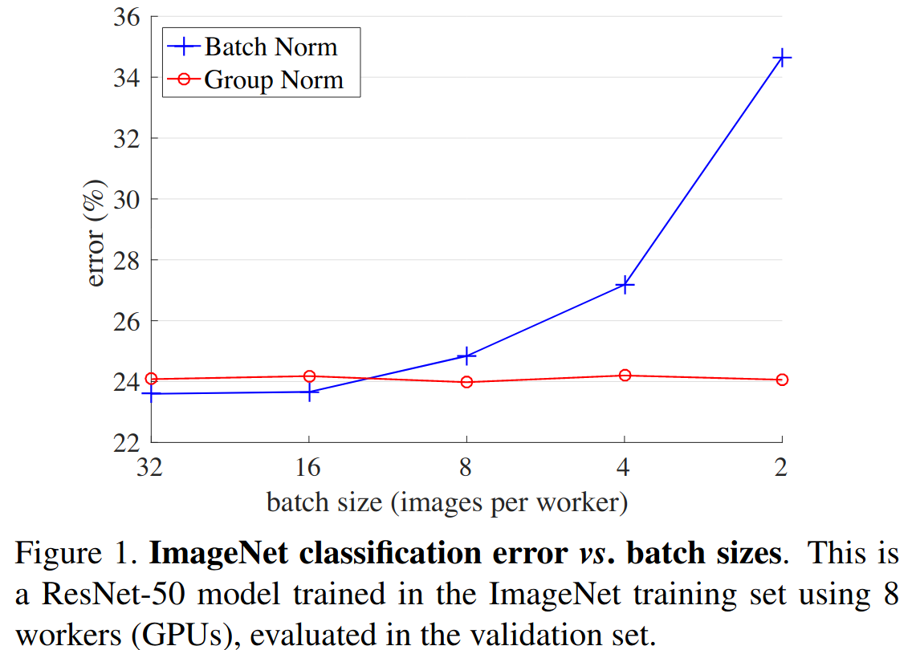

<center>
     <h1>Group Normalization解析</h1>
 </center>

## 1、Layer Normalization

论文名称：Group Normalization

论文地址：https://arxiv.org/abs/1803.08494

在之前的文章中有介绍过[Batch Normalization](https://github.com/MorvanLi/Python/tree/main/pytorch_classification/normalization/batch%20normalization)，以及[Layer Normalization](https://github.com/MorvanLi/Python/tree/main/pytorch_classification/normalization/layernormalization)。今天来简单聊聊GN(Group Normalization)。在视觉领域，其实最常用的还是BN，但BN也有缺点，通常需要比较大的Batch Size。如下图所示，蓝色的线代表BN，当batch size小于16后error明显升高（但大于16后的效果确实要更好）。对于比较大型的网络或者GPU显存不够的情况下，通常无法设置较大的batch size，此时可以使用GN。如下图所示，batch size的大小对GN并没有影响，所以**当batch size设置较小时，可以采用GN**。





无论是BN、LN还是GN，公式都是一样的，都是减均值$E(x) $，除以标准差$\sqrt{Var(x)+\epsilon } $，其中$\epsilon $是一个非常小的数字默认$10^{-5} $，是为了防止分母为零。以及两个可训练的参数$\beta ,\gamma $。不同在于是在哪个/哪些维度上进行操作：
$$
y=\frac{x-E(x)}{\sqrt{Var(x)+\epsilon } }
$$
对于GN(Group Normalization)的操作如下图所示，假设$num\_groups = 2$原论文中默认为32，由于和batch_size无关，我们直接看对于一个样本的情况。假设某层输出得到$x$，根据$num\_groups$沿着$channel$分成$num\_groups$份。然后对每一份求均值和方差，接着按照上面的公式进行计算即可，非常简单。


## 2、 pytorch 实验

为了验证自己理解的是否正确，下面使用Pytorch做个简单的实验，创建一个随机变量，分别使用官方的GN方法和自己实现的GN方法做对比，看结果是否一样。

```python
# author_='bo.li';
# date: 3/7/22 10:47 AM

import torch
import torch.nn as nn


def group_norm(x: torch.Tensor,
               num_groups: int,
               num_channels: int,
               eps: float = 1e-5,
               gramma: float = 1.0,
               beta: float = 0.):
    """

    :param x: input data must a tensor
    :param num_groups:
    :param num_channels:
    :param eps: default value is 1e-5
    :param gramma: default value is 1.
    :param beta: default value is 0.
    return a tensor with same shape x
    """
    assert divmod(num_channels, num_groups)[1] == 0
    channels_per_group = num_channels // num_groups

    new_tensor = []
    # [b, c, h, w] ----> ([b, 2, h, w], [b, 2, h, w])
    for c in x.split(channels_per_group, dim=1):
        var_mean = torch.var_mean(c, dim=[1, 2, 3], unbiased=False)
        var = var_mean[0]
        mean = var_mean[1]
        c = (c-mean[:, None, None, None]) / (torch.sqrt(var[:, None, None, None] + eps))
        c = c * gramma + beta
        new_tensor.append(c)
    new_tensor = torch.cat(new_tensor, dim=1)
    return new_tensor

def main():
    num_groups = 2
    num_channels = 4
    eps = 1e-5

    img = torch.rand(2, num_channels, 2, 2)
    # print(img)

    gn = nn.GroupNorm(num_groups=num_groups, num_channels=num_channels, eps=eps)
    r1 = gn(img)
    print(r1)

    r2 = group_norm(img, num_groups, num_channels, eps)
    print(r2)


if __name__ == '__main__':
    main()
```


***


##  Tensor.split()的用法：Splits the tensor into chunks（split()作用将tensor分成块结构）

```python
import torch
 
x = torch.rand(4,8,6)
y = torch.split(x,2,dim=0) #按照4这个维度去分，每大块包含2个小块
for i in y :
    print(i.size())
 
output:
torch.Size([2, 8, 6])
torch.Size([2, 8, 6])
 
y = torch.split(x,3,dim=0)#按照4这个维度去分，每大块包含3个小块
for i in y:
    print(i.size())
 
output:
torch.Size([3, 8, 6])
torch.Size([1, 8, 6])
```

