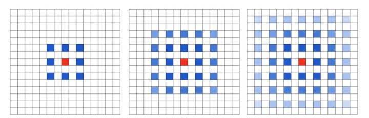
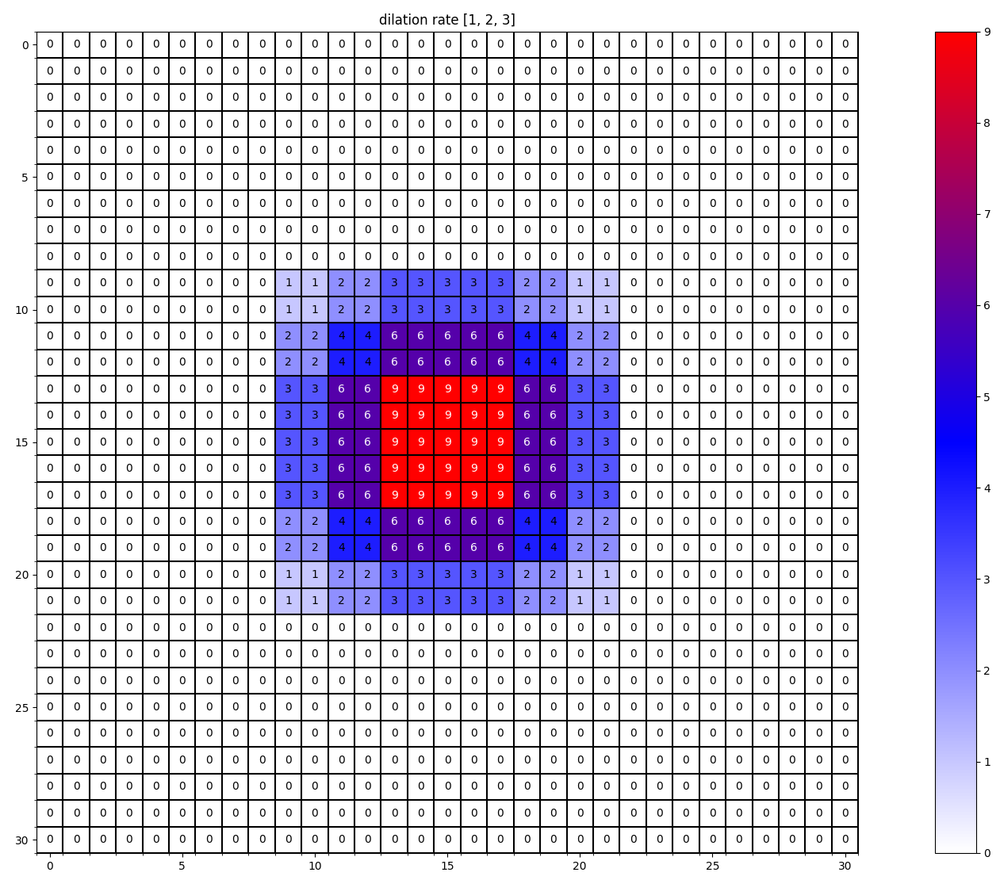
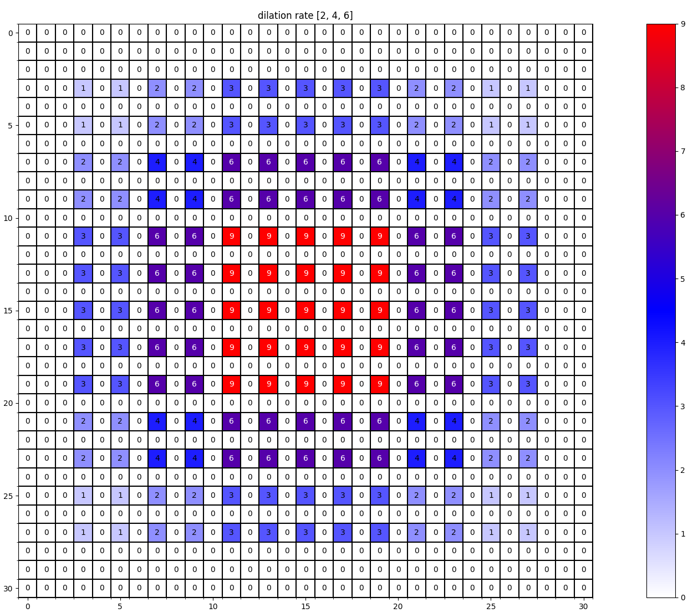
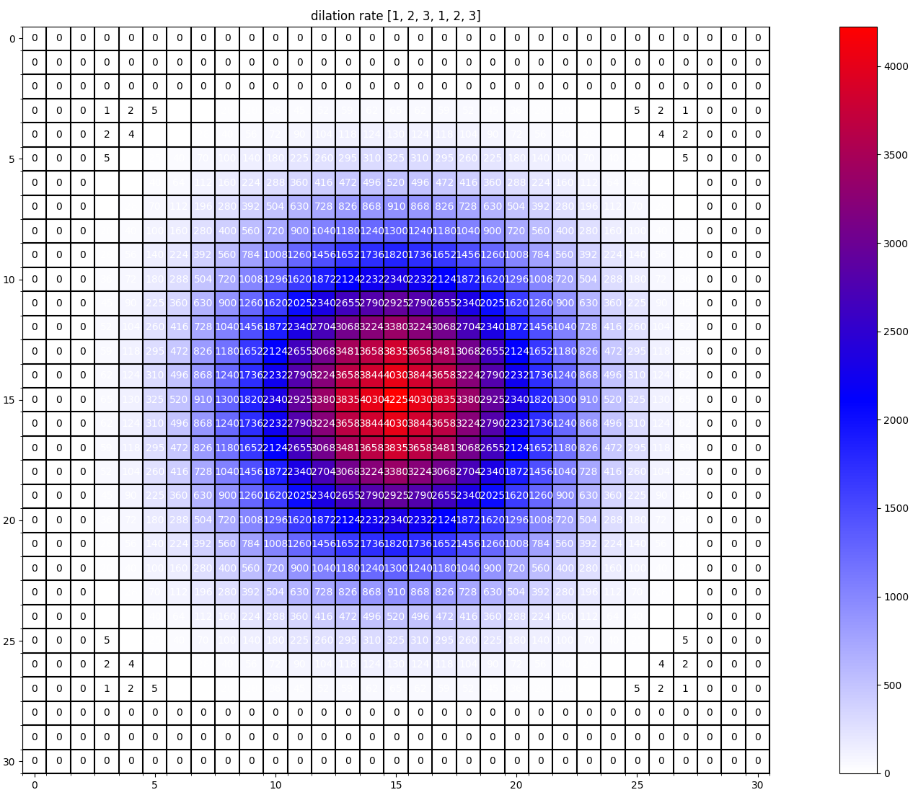

     <h1>Dilated Convolution膨胀卷积</h1>
 

## 1、Dilated Convolution（膨胀卷积）

在图像分割领域，图像输入到CNN（典型的网络比如FCN）中，FCN先像传统的CNN那样对图像做卷积再pooling，降低图像尺寸的同时增大感受野，但是由于图像分割预测是pixel-wise的输出，所以要将pooling后较小的图像尺寸upsampling到原始的图像尺寸进行预测，之前的pooling操作使得每个pixel预测都能看到较大感受野信息。因此图像分割FCN中有两个关键，一个是pooling减小图像尺寸增大感受野，另一个是upsampling扩大图像尺寸。在先减小再增大尺寸的过程中，肯定有一些信息损失掉了，那么能不能设计一种新的操作，**不通过pooling也能有较大的感受野看到更多的信息呢？答案就是dilated conv。**

普通卷积:

膨胀卷积:

## 2、空洞卷积的问题及解决

对于 dilated convolution， 我们已经可以发现他的优点，即内部数据结构的保留和避免使用 down-sampling 这样的特性。但是完全基于 dilated convolution 的结构如何设计则是一个新的问题。

**潜在问题 1：The Gridding Effect**

假设我们仅仅多次叠加 dilation rate 2 的 3 x 3 kernel 的话，则会出现这个问题：

我们发现我们的 **kernel 并不连续**，也就是并不是所有的 pixel 都用来计算了，因此这里将信息看做 checker-board 的方式会损失信息的连续性。这对 pixel-level dense prediction 的任务来说是致命的。

**潜在问题 2：Long-ranged information might be not relevant.**

我们从 dilated convolution 的设计背景来看就能推测出这样的设计是用来获取 long-ranged information。然而光采用大 dilation rate 的信息或许只对一些大物体分割有效果，而对小物体来说可能则有弊无利了。如何同时处理不同大小的物体的关系，则是设计好 dilated convolution 网络的关键。

## 3、解决：通向标准化设计Hybrid Dilated Convolution (HDC)

对于上个 section 里提到的几个问题，图森组的文章对其提出了较好的解决的方法。他们设计了一个称之为 HDC 的设计结构。

- 第一个特性是，**叠加卷积的 dilation rate 不能有大于1的公约数。**比如 [2, 4, 6] 则不是一个好的三层卷积，依然会出现 gridding effect。
- 第二个特性是，**将 dilation rate 设计成锯齿状结构**，例如 [1, 2, 5, 1, 2, 5] 循环结构。
- 第三个特性是，需要满足一下这个式子：$M_{i} = max[M_{i+1} -2r_{i}, M_{i+1}-2(M_{i+1} - r_{i}), r_{i}]  $

其中，$r_{i}$是$i$层的$dilation 　rate$而$M_{i}$是值在$i$层的最大$dilation　rate$，假设总共有$n$层，默认$M_{n}=r_{n}$。**$kernal$大小为$k$，那么必须保证$M_{2} <= k$**，这样至少可以用$dilation　rate$1即标准的卷积方式来覆盖掉所有的洞。

## 4、感受野计算（Recptive Field）

- **定义：**感受野用来表示网络内部的不同神经元对原图像的感受范围的大小，或者说，CNN每一层输出的特征图(feature map)上的像素点在原始图像上映射的区域大小。

​	$$(N-1)\_RF = (N\_RF-1) * stride+kernel\_size $$

举例说明：

**膨胀后卷积核尺寸 = 膨胀系数 * (原始卷积核尺寸 - 1) + 1**

对于dilation rate为[1, 2 ,3]，kerner大小为3 * 3

- 第一层的对应的感受野为3 * 3。<----------- (1-1) * 1 + 3 = 3
- 第二层的对应的感受野为7 * 7。<----------- (3-1) * 1 + 5 = 7
- 第三层的对应的感受野为13 * 13。<----------- (7-1) * 1 + 7 = 13

对于dilation rate为[1, 2 , 4]，kerner大小为3 * 3

- 第一层的对应的感受野为3 * 3。<----------- (1-1) * 1 + 3 = 3
- 第二层的对应的感受野为7 * 7。<----------- (3-1) * 1 + 5 = 7
- 第三层的对应的感受野为15 * 15。<----------- (7-1) * 1 + 9 = 15
