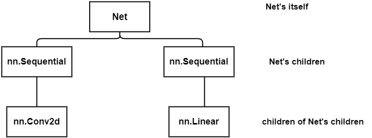

 <center>
     <h1>pytorch常用操作日常记录</h1>
 </center>

###  1 、 如何求tensor的均值和方差

1. [torch.mean](https://pytorch.org/docs/stable/generated/torch.mean.html?highlight=torch%20mean#torch.mean)
2. [torch.val](https://pytorch.org/docs/stable/generated/torch.std.html?highlight=torch%20std#torch.std)
3. [torch.var_mean](https://pytorch.org/docs/stable/generated/torch.var_mean.html?highlight=torch%20var_mean#torch.var_mean)

### 2、如何交换维度顺序

1. [torch.transpose](https://pytorch.org/docs/stable/generated/torch.transpose.html?highlight=transpose#torch.transpose)
2. [torch.permute](https://pytorch.org/docs/stable/generated/torch.permute.html#torch.permute)

区别在于，transpose一次只能完成两个维度的转换，permute可以同时完成多个维度转换。


### 3、如何计算tensor的形状

1. tensor.shape

2. tensor.size()

   

### 4、如何拼接和切割tensor

1. [tensor.cat](https://pytorch.org/docs/stable/generated/torch.cat.html?highlight=cat#torch.cat)
2. [tensor.stack](https://pytorch.org/docs/stable/generated/torch.stack.html?highlight=torch%20stack#torch.stack)
3. [tensor.split](https://pytorch.org/docs/stable/generated/torch.split.html#torch.split)
4. [tensor.chunk](https://pytorch.org/docs/stable/generated/torch.chunk.html#torch.chunk)


### 5、如何遍历整个模型




1. [modules()]([Module — PyTorch 1.11.0 documentation](https://pytorch.org/docs/stable/generated/torch.nn.Module.html?highlight=named_modules#torch.nn.Module.named_modules))

   ```python
   class Net(nn.Module):
       def __init__(self):
           super(Net, self).__init__()
           self.features = nn.Sequential(
               nn.Conv2d(3, 48, kernel_size=11, stride=4, padding=2)
           )
           self.classifier = nn.Sequential(
               nn.Linear(128 * 6 * 6, 2048),
           )
           for idx, m in enumerate(self.modules()):
               print(f"{idx} -> {m}")
   
   0 -> Net(
     (features): Sequential(
       (0): Conv2d(3, 48, kernel_size=(11, 11), stride=(4, 4), padding=(2, 2))
     )
     (classifier): Sequential(
       (0): Linear(in_features=4608, out_features=2048, bias=True)
     )
   )
   1 -> Sequential(
     (0): Conv2d(3, 48, kernel_size=(11, 11), stride=(4, 4), padding=(2, 2))
   )
   2 -> Conv2d(3, 48, kernel_size=(11, 11), stride=(4, 4), padding=(2, 2))
   3 -> Sequential(
     (0): Linear(in_features=4608, out_features=2048, bias=True)
   )
   4 -> Linear(in_features=4608, out_features=2048, bias=True)
   ```

2. [named_modules()]([Module — PyTorch 1.11.0 documentation](https://pytorch.org/docs/stable/generated/torch.nn.Module.html?highlight=named_modules#torch.nn.Module.named_modules))

   ```python
   0 -> ('', Net(
     (features): Sequential(
       (0): Conv2d(3, 48, kernel_size=(11, 11), stride=(4, 4), padding=(2, 2))
     )
     (classifier): Sequential(
       (0): Linear(in_features=4608, out_features=2048, bias=True)
     )
   ))
   1 -> ('features', Sequential(
     (0): Conv2d(3, 48, kernel_size=(11, 11), stride=(4, 4), padding=(2, 2))
   ))
   2 -> ('features.0', Conv2d(3, 48, kernel_size=(11, 11), stride=(4, 4), padding=(2, 2)))
   3 -> ('classifier', Sequential(
     (0): Linear(in_features=4608, out_features=2048, bias=True)
   ))
   4 -> ('classifier.0', Linear(in_features=4608, out_features=2048, bias=True))
   ```

3. [children]([Module — PyTorch 1.11.0 documentation](https://pytorch.org/docs/stable/generated/torch.nn.Module.html?highlight=named_children#torch.nn.Module.named_children))

   ```python
   0 -> Sequential(
     (0): Conv2d(3, 48, kernel_size=(11, 11), stride=(4, 4), padding=(2, 2))
   )
   1 -> Sequential(
     (0): Linear(in_features=4608, out_features=2048, bias=True)
   )
   ```
   
   
   
3. [named_children]([Module — PyTorch 1.11.0 documentation](https://pytorch.org/docs/stable/generated/torch.nn.Module.html?highlight=named_children#torch.nn.Module.named_children))

   ```python
   0 -> ('features', Sequential(
     (0): Conv2d(3, 48, kernel_size=(11, 11), stride=(4, 4), padding=(2, 2))
   ))
   1 -> ('classifier', Sequential(
     (0): Linear(in_features=4608, out_features=2048, bias=True)
   ))
   ```

self.modules()采用**深度优先遍历**的方式，存储了net的所有模块，包括`net itself`,`net's children`, `children of net's children`。self.children()只包括网络模块的第一代儿子模块，而self.modules()包含网络模块的自己本身和所有后代模块。


