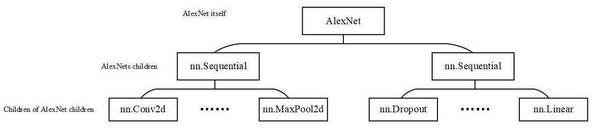
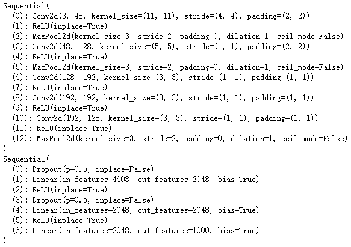
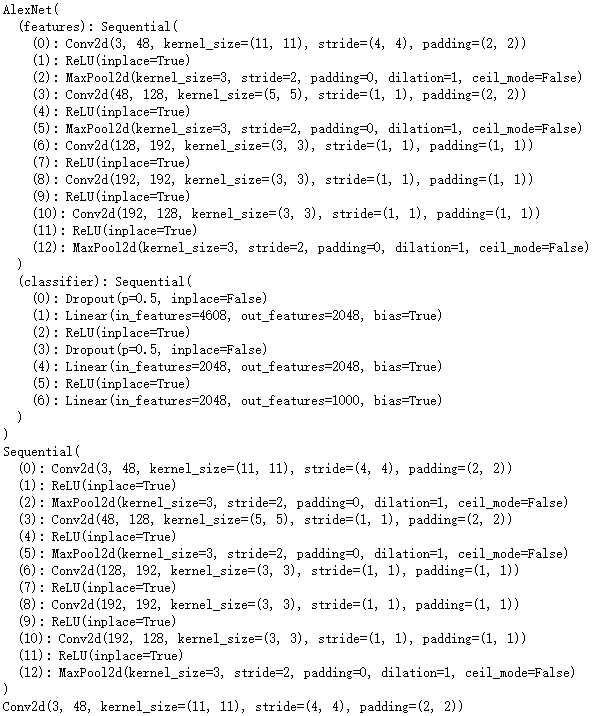

## self.modules() 和 self.children()**的区别**

本文主要讲述：

1. **self.modue、self.children、self.named_modue、self.named_children区别与联系**

   

```python
class Net(nn.Module):
    def __init__(self, num_classes=1000, init_weights=True):
        super(AlexNet, self).__init__()
        self.features = nn.Sequential(
            nn.Conv2d(3, 48, kernel_size=11, stride=4, padding=2),  # input[3, 224, 224]  output[48, 55, 55]
            nn.ReLU(inplace=True),
            nn.MaxPool2d(kernel_size=3, stride=2),                  # output[48, 27, 27]
            nn.Conv2d(48, 128, kernel_size=5, padding=2),           # output[128, 27, 27]
            nn.ReLU(inplace=True),
            nn.MaxPool2d(kernel_size=3, stride=2),                  # output[128, 13, 13]
            nn.Conv2d(128, 192, kernel_size=3, padding=1),          # output[192, 13, 13]
            nn.ReLU(inplace=True),
            nn.Conv2d(192, 192, kernel_size=3, padding=1),          # output[192, 13, 13]
            nn.ReLU(inplace=True),
            nn.Conv2d(192, 128, kernel_size=3, padding=1),          # output[128, 13, 13]
            nn.ReLU(inplace=True),
            nn.MaxPool2d(kernel_size=3, stride=2),                  # output[128, 6, 6]
        )
        self.classifier = nn.Sequential(
            nn.Dropout(p=0.5),
            nn.Linear(128 * 6 * 6, 2048),
            nn.ReLU(inplace=True),
            nn.Dropout(p=0.5),
            nn.Linear(2048, 2048),
            nn.ReLU(inplace=True),
            nn.Linear(2048, num_classes),
        )
        
        for i, module in self.named_children():
            print(i, module)
        print("*"*50)
        for i, module in self.named_modules():
            print(i, module)
        print("-"*50)
        if init_weights:
            self._initialize_weights()

    def forward(self, x):
        x = self.features(x)
        x = torch.flatten(x, start_dim=1)
        x = self.classifier(x)
        return x

    def _initialize_weights(self):
        for name, m in self.named_children():
            if isinstance(m, nn.Sequential):
                print(name)
                nn.init.kaiming_normal_(m.weight, mode='fan_out', nonlinearity='relu')
                if m.bias is not None:
                    nn.init.constant_(m.bias, 0)
            elif isinstance(m, nn.Linear):
                nn.init.normal_(m.weight, 0, 0.01)
                nn.init.constant_(m.bias, 0)
```


##### 网络结构解读：

这是一个二层的网络结构，将第一层的feature放在一个`nn.Sequential`层中，将第二层的classifier放在第二个`nn.Sequential`中。
整个网络结构如下图所示：




***

**self.children()**




**self.modules()**





## 结论

1. **self.children()只包括网络模块的第一代儿子模块，而self.modules()包含网络模块的自己本身和所有后代模块。**
2. **self.modules()采用深度优先遍历的方式，存储了AlexNet的所有模块，包括AlexNet itself, AlexNet's children, children of AlexNet's children。**
3. **self.named_children()和self.named_modules()只是将网络层的名字显示处理**


