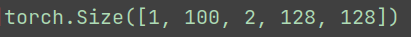

 <center>
     <h1>Pytorch技巧:DataLoader的collate_fn参数使用详解</h1>
 </center>

## **DataLoader完整的参数表如下：** 

```python
class torch.utils.data.DataLoader(
 dataset,
 batch_size=1,
 shuffle=False,
 sampler=None,
 batch_sampler=None,
 num_workers=0,
 collate_fn=<function default_collate>,
 pin_memory=False,
 drop_last=False,
 timeout=0,
 worker_init_fn=None)
```


DataLoader在数据集上提供单进程或多进程的迭代器，几个关键的参数意思：

1. `shuffle`：设置为True的时候，打乱数据集。
2. `collate_fn`：**如何取样本的，我们可以定义自己的函数来准确地实现想要的功能**。
3. `drop_last`：告诉如何处理数据集长度除于batch_size余下的数据。True就抛弃，否则保留。


##  **如果是图像数据的话，可以写成如下形式**：

```python
def detection_collate(batch):
    """Custom collate fn for dealing with batches of images that have a different
    number of associated object annotations (bounding boxes).
    Arguments:
        batch: (tuple) A tuple of tensor images and lists of annotations
    Return:
        A tuple containing:
            1) (tensor) batch of images stacked on their 0 dim
            2) (list of tensors) annotations for a given image are stacked on
                                 0 dim
    """
    targets = []
    imgs = []
    for sample in batch:
        imgs.append(sample[0])
        targets.append(torch.FloatTensor(sample[1]))
    return torch.stack(imgs, 0), targets

# 代码只写出了collate_fn部分，其余的省略了。
dataloader = torch.utils.data.DataLoader(
                    collate_fn=detection_collate,
                    )
```


## 为什么要重写custom_collate_fn？


**通俗一点来说，为了符合我们自定义的输入数据格式，默认的collate_fn只会生成一个4个维度的数据，假设我们想给网络一个5维的数据那么就必须自己重写这个方法。**

在实际训练BPTT过程中，我们的网络需要一个5个维度的数据。


```python
@staticmethod
    def custom_collate_fn(batch):
        """Collate function passed into the torch.utils.data.Dataloader"""
        inp_ts_list = []
        xypt_np_list = []
        lb_ts_list = []
        # lb_ts_list_2 = []
        for sample in batch:
            inp_ts_list.append(sample[0])
            xypt_np_list.append(sample[1])
            lb_ts_list.append(sample[2]
        print(torch.stack(inp_ts_list, dim=0).shape)  # print [1, 100, 2, 128, 128] -------> [batch, raster, polarity, height, width]
        return torch.stack(inp_ts_list, dim=0), xypt_np_list, torch.stack(lb_ts_list, dim=0)
```




